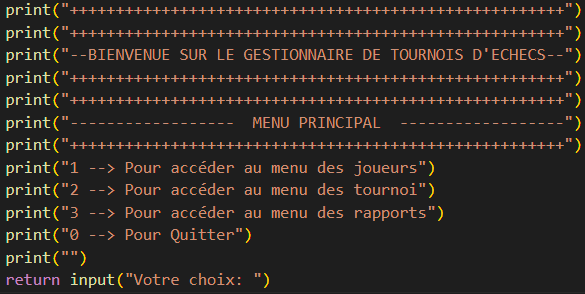

## Etapes à suivre pour l'installation et l'utilisation du Programme des gestion des tournois d'échecs

### Etapes d'installation:

#### Installer Python

L’installation de Python est très simple ! Rendez-vous sur [python.org](https://www.python.org/downloads/), choisissez votre système d’exploitation (Mac/Windows, etc.) et cliquez sur le bouton de téléchargement pour installer Python sur votre ordinateur.

Si vous utilisez Windows, pensez à bien cocher la case "Add to path" pour ajouter Python aux variables d'environnement.

#### Faire une copie du repository.

A partir du lien GitHub: https://github.com/FloJouff/ChessTournament, créer un clone du projet en local sur votre ordinateur

#### Création de l'environnement virtuel

Depuis votre terminal, à la racine du projet, créer un environnement virtuel, afin d'y installer uniquement les paquets Python nécessaires à l'exécution du script.

    $ python -m venv env

#### Activation de l'environnement virtuel

A partir du terminal, taper la commande suivante:

    $ source env/bin/activate (pour MacOs, Linux)
    $ env\scripts\activate (pour Windows)

#### Installation des paquets Python nécessaires à l'execution du code:

Le fichier --requirements.txt-- a été cloné à partir du repository GitHub.
A partir du terminal, taper la commande suivante:

    $ pip install -r requirements.txt

Une fois l'installation terminée, taper la commande suivante pour vous assurer de l'installation correcte des modules requis:

    $ pip freeze

### Exécution du code d'application:

Exécuter à partir d'un terminal de commande le fichier main.py:

    $ python main.py

Un menu à choix multiples s'ouvre:

D'autres menus s'ouvriront en fonction de vos besoins.

### Consultation des données générées par les rapports:

Les différents rapports générés sont au format .csv
Ils apparaissent également sur la console en meme temps afin de s'assurer que la demande correspond bien au besoin.

Ils sont identifiés pour être retoruvés facilement en fonction du rapport demandé.

Pour les consulter, il faut les ouvrir avec Excel ou équivalent:

Avec Excel:

"Data" (ou données)
"From Text"
Sélectionner le fichier à consulter --> "Get-data"
"Delimited" --> "Next"
"Comma" (ou virgules) --> "Next"
"Finish" puis "Ok"
